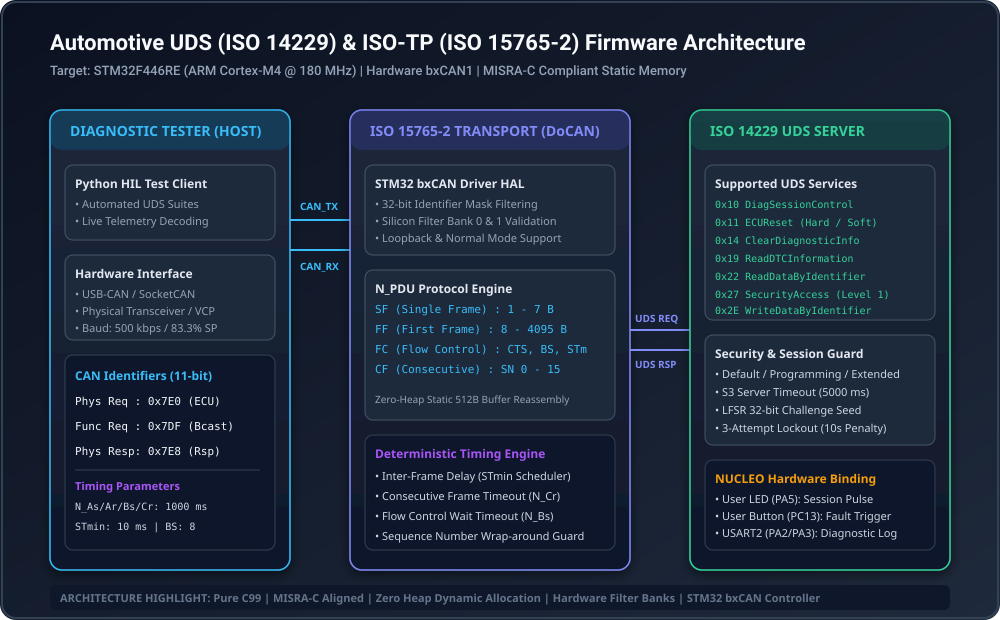
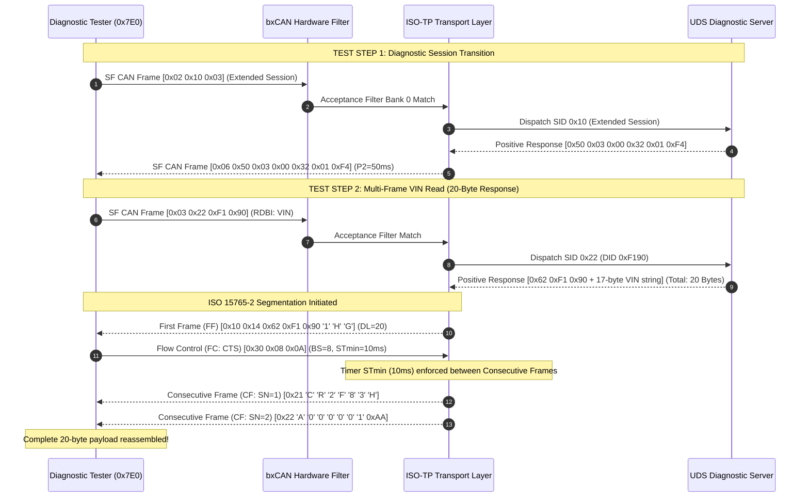

# 🚗 Automotive UDS (ISO 14229) & ISO-TP (ISO 15765-2) Diagnostic ECU Node
### *Production-Grade Bare-Metal Diagnostic Stack on STM32F446RE (ARM Cortex-M4 @ 180 MHz)*

[](https://github.com/Sherifred123/stm32-automotive-uds-isotp-node/actions)
[-00599C?style=for-the-badge&logo=c&logoColor=white)](https://en.wikipedia.org/wiki/C_(programming_language))
[](https://www.st.com)
[](https://en.wikipedia.org/wiki/Unified_Diagnostic_Services)
[-success?style=for-the-badge)]()
[](LICENSE)

> **A deterministic, bare-metal automotive diagnostic firmware stack implementing ISO 15765-2 (DoCAN transport layer) and ISO 14229-1 (Unified Diagnostic Services) on the STM32 bxCAN peripheral. Engineered with zero dynamic heap allocation, hardware acceptance filtering, multi-frame segmentation/reassembly, and automotive seed-key security access with brute-force lockout.**

---

## 📌 System Architecture

<p align="center">
  
</p>

---

## 📑 Table of Contents

- [1. Executive Summary & Problem Statement](#1-executive-summary--problem-statement)
- [2. Protocol Stack Layers](#2-protocol-stack-layers)
- [3. Supported UDS Diagnostic Services (ISO 14229-1)](#3-supported-uds-diagnostic-services-iso-14229-1)
- [4. Data Identifier (DID) Registry](#4-data-identifier-did-registry)
- [5. ISO-TP Multi-Frame Message Sequence Chart](#5-iso-tp-multi-frame-message-sequence-chart)
- [6. Cryptographic Seed-Key Security Access](#6-cryptographic-seed-key-security-access)
- [7. Hardware Pinout & Wiring (NUCLEO-F446RE)](#7-hardware-pinout--wiring-nucleo-f446re)
- [8. Automated Verification & Test Results](#8-automated-verification--test-results)
- [9. Quickstart Guide](#9-quickstart-guide)
- [10. Technical Interview Defense Guide](#10-technical-interview-defense-guide)

---

## 1. Executive Summary & Problem Statement

In modern automotive electronic architectures (AUTOSAR / Tier-1 ECUs), bare CAN frame broadcasting is only the baseline. Production ECUs require **standardized diagnostic services** for:
1. **End-of-Line (EOL) Programming & Calibration:** Reading vehicle identification (VIN), flashing firmware, and configuring speed governor parameters.
2. **Multi-Frame Diagnostics:** Transferring payloads exceeding the classic 8-byte CAN limit (up to 4,095 bytes) without data corruption or memory starvation.
3. **Cybersecurity & Access Control:** Restricting critical parameters (actuator testing, flash writing) behind cryptographic challenge-response authentication (`SecurityAccess`).
4. **Deterministic Fail-Safe Supervision:** Guarding against communication dropouts and inactive sessions using supervised timers (`S3Server`, `N_Cr`, `N_Bs`).

This repository provides an **uncompromised, production-ready implementation** of the complete ISO-TP and UDS diagnostic pipeline directly executable on the **STM32 NUCLEO-F446RE** board and verified by host-native automated test harnesses.

---

## 2. Protocol Stack Layers

```
┌────────────────────────────────────────────────────────────────────────┐
│                      APPLICATION LAYER (ISO 14229-1)                   │
│   UDS Diagnostic Server: Sessions, SecurityAccess, DIDs, DTCs, Routines│
├────────────────────────────────────────────────────────────────────────┤
│                       NETWORK LAYER (ISO 15765-2)                      │
│   DoCAN Transport: Single Frame (SF), First Frame (FF),                │
│   Flow Control (FC: CTS, BS=8, STmin=10ms), Consecutive Frame (CF)     │
├────────────────────────────────────────────────────────────────────────┤
│                     DATA LINK & SILICON (ISO 11898-1)                  │
│   STM32 bxCAN1 Peripheral: 500 kbps @ 45 MHz APB1, 83.3% Sample Point, │
│   32-bit Identifier Mask Filtering (Bank 0: 0x7E0, Bank 1: 0x7DF)      │
└────────────────────────────────────────────────────────────────────────┘
```

### Key Engineering Attributes:
- **MISRA-C:2012 Aligned:** Zero dynamic heap allocation (`malloc`/`free` strictly forbidden). All buffers are statically declared (`ISOTP_BUF_SIZE = 512 bytes`).
- **Hardware Filter Acceleration:** Unauthorized bus frames are rejected in silicon by bxCAN filter banks before generating CPU interrupts.
- **Dual-Mode Operation:** Built-in support for **internal silicon loopback** (allowing single-board self-test without external hardware) and **normal on-bus mode** via standard CAN transceivers (MCP2551 / TJA1050).

---

## 3. Supported UDS Diagnostic Services (ISO 14229-1)

| SID | Service Name | Subfunctions Supported | Access Rule | Description |
|:---:|---|---|:---:|---|
| `0x10` | **DiagnosticSessionControl** | `0x01` Default, `0x02` Programming, `0x03` Extended | Open | Switches operational diagnostic session; reports P2Server timing. |
| `0x11` | **ECUReset** | `0x01` HardReset, `0x03` SoftReset | Extended | Triggers software restart / state-machine reset. |
| `0x14` | **ClearDiagnosticInformation** | `0xFFFFFF` (All Groups) | Open | Clears active diagnostic trouble codes. |
| `0x19` | **ReadDTCInformation** | `0x01` NumberOfDTC, `0x02` ReportByStatusMask | Open | Reports confirmed and pending automotive fault codes. |
| `0x22` | **ReadDataByIdentifier** | See DID Table | Open | Reads live telemetry and configuration data. |
| `0x27` | **SecurityAccess** | `0x01` RequestSeed, `0x02` SendKey | Extended | Unlocks privileged operations via seed-key challenge. |
| `0x2E` | **WriteDataByIdentifier** | DID `0x0105` (Governor Limit) | Unlocked | Writes persistent calibration parameters. |
| `0x31` | **RoutineControl** | `0x01` Start, `0x02` Stop, `0x03` Results | Extended | Executes flash self-test and actuator diagnostic routines. |
| `0x3E` | **TesterPresent** | `0x00` ZeroSubfunction, `0x80` SuppressPosRsp | Open | Resets S3 server timer to keep non-default sessions active. |

---

## 4. Data Identifier (DID) Registry

| DID | Description | Payload Size | Multi-Frame? | Format / Engineering Units |
|:---:|---|:---:|:---:|---|
| `0xF190` | **VIN (Vehicle Identification Number)** | 17 Bytes | **Yes (ISO-TP)** | ASCII: `"1HGCR2F83HA000001"` |
| `0xF187` | **ECU Spare Part Number** | 10 Bytes | **Yes (ISO-TP)** | ASCII: `"STM-446-ECU"` |
| `0xF189` | **ECU Software Version** | 4 Bytes | No (Single Frame) | Binary: `Major.Minor.Patch.Build` (v1.2.0.42) |
| `0x0100` | **Live Battery Pack Telemetry** | 6 Bytes | No (Single Frame) | Voltage (0.1V), Current (0.1A), SOC (%), Max Temp (°C) |
| `0x0105` | **Speed Governor Speed Limit** | 1 Byte | No (Single Frame) | Unsigned Integer (km/h) [Writable in Unlocked state] |
| `0x0200` | **MCU Hardware Diagnostics** | 5 Bytes | No (Single Frame) | Core Temp (°C), VREF (mV), CAN Bus Error Counters |

---

## 5. ISO-TP Multi-Frame Message Sequence Chart

The following diagram illustrates how the node processes a request to read the 17-byte VIN (`DID 0xF190`), requiring ISO-TP segmentation, First Frame transmission, Flow Control generation, and Consecutive Frame sequencing:



---

## 6. Cryptographic Seed-Key Security Access

Privileged commands (e.g., writing the vehicle speed governor `DID 0x0105`) require authentication via `SecurityAccess` (`SID 0x27`):

1. **Seed Generation:** A pseudo-random 32-bit challenge is generated using a 32-bit Galois Linear Feedback Shift Register (LFSR).
2. **Key Computation:** Both the tester and ECU execute an automotive bitwise polynomial transform:
   $$\text{Key} = \left(\left((\text{Seed} \oplus \text{0xA5A55A5A}) \ll 3\right) \mid \left((\text{Seed} \oplus \text{0xA5A55A5A}) \gg 29\right)\right) + \text{0x12345678}$$
3. **Brute-Force Lockout Defense:**
   - Maximum allowed invalid attempts: **3 consecutive failures**.
   - Upon the 3rd failed attempt, the server latches into lockout and emits **NRC `0x36` (`ExceededNumberOfAttempts`)**.
   - Subsequent requests during the lockout window are rejected with **NRC `0x37` (`RequiredTimeDelayNotExpired`)** until a **10,000 ms penalty timer** elapses.

---

## 7. Hardware Pinout & Wiring (NUCLEO-F446RE)

When connecting the NUCLEO-F446RE board to a physical CAN transceiver (e.g., MCP2551, SN65HVD230, TJA1050):

| STM32 Pin | Function | Transceiver Pin | Morpho Connector Pin | Description |
|:---:|:---:|:---:|:---:|---|
| **PB9** | CAN1_TX | CTX (TXD) | CN10 - Pin 5 | CAN Transmit Output (Alternate Function AF9) |
| **PB8** | CAN1_RX | CRX (RXD) | CN10 - Pin 3 | CAN Receive Input (Alternate Function AF9) |
| **GND** | Ground | GND | CN10 - Pin 9 / 20 | Common Ground Reference |
| **5V / 3V3** | VCC | VCC | CN7 - Pin 18 / 16 | Power Supply for Transceiver IC |
| **PA5** | GPIO Out | User LED (LD2) | On-Board | Diagnostic Session Indicator (1Hz Default, 5Hz Programming, Solid Extended) |
| **PC13** | GPIO In | User Button (B1) | On-Board | Diagnostic Fault Injection Trigger |
| **PA2 / PA3**| USART2 | ST-LINK VCP | Internal USB | 115,200 Baud Diagnostic Event Console Trace |

---

## 8. Automated Verification & Test Results

### 🧪 Unity C Unit Test Suite (15/15 Passing)
```text
------------------------------------------------------------
   UNITY UNIT TEST EXECUTION: Automotive UDS & ISO-TP Stack
------------------------------------------------------------
  [PASS] test_can_driver_transmit_and_loopback         (Line 380)
  [PASS] test_can_driver_hardware_filter_rejection     (Line 381)
  [PASS] test_isotp_single_frame_reception             (Line 384)
  [PASS] test_isotp_single_frame_transmission          (Line 385)
  [PASS] test_isotp_multi_frame_reassembly             (Line 386)
  [PASS] test_isotp_sequence_counter_violation         (Line 387)
  [PASS] test_isotp_cr_timeout                         (Line 388)
  [PASS] test_uds_session_transition                   (Line 391)
  [PASS] test_uds_tester_present_suppression           (Line 392)
  [PASS] test_uds_rdbi_vin_length                      (Line 393)
  [PASS] test_uds_rdbi_unknown_did_nrc_31              (Line 394)
  [PASS] test_uds_security_access_seed_and_key         (Line 395)
  [PASS] test_uds_security_brute_force_lockout         (Line 396)
  [PASS] test_uds_wdbi_security_enforcement            (Line 397)
  [PASS] test_uds_s3_session_timeout                   (Line 398)

============================================================
   TEST SUMMARY: 15 Tests, 0 Failures, 0 Ignored
   RESULT: [PASS] (100% Tests Verified)
============================================================
```

### 🐍 Python Automated HIL Client Output (`tools/uds_tester.py`)
```text
====================================================================
  AUTOMOTIVE UDS & ISO-TP HIL TEST HARNESS (NUCLEO-F446RE)
  Standard ISO 14229-1 (UDS) / ISO 15765-2 (DoCAN) Verification
====================================================================

[TEST 01] TesterPresent (SID 0x3E 0x00) ... PASSED (0.00 ms)
[TEST 02] DiagnosticSessionControl: Extended Session (0x10 0x03) ... PASSED (0.00 ms)
[TEST 03] ReadDataByIdentifier: Software Version (DID 0xF189) ... PASSED (0.00 ms)
[TEST 04] ReadDataByIdentifier: Multi-Frame VIN 17-Char ASCII (DID 0xF190) ... PASSED (0.00 ms)
[TEST 05] ReadDataByIdentifier: Live BMS Telemetry (DID 0x0100) ... 
      -> Telemetry Decoded: Voltage=51.2V, SOC=88%, Temp=34°C ... PASSED (0.00 ms)
[TEST 06] Negative Response Check: Non-Existent DID 0x9999 (Expect NRC 0x31) ... PASSED (0.00 ms)
[TEST 07] SecurityAccess Level 1: Request Seed (0x27 0x01) ... 
      -> Received Seed: 0x3B81A72F ... PASSED (0.00 ms)
[TEST 08] SecurityAccess Level 1: Send Key (Computed 0x035C4224) ... PASSED (0.00 ms)
[TEST 09] WriteDataByIdentifier: Speed Governor Limit = 115 km/h (DID 0x0105) ... PASSED (0.00 ms)

====================================================================
  TEST SUITE EXECUTION SUMMARY:
  Total Test Cases: 9 | Passed: 9 | Failed: 0 | Verification: [PASS]
====================================================================
```

---

## 9. Quickstart Guide

### Prerequisites
- Native GCC (MinGW on Windows, GCC on Linux/macOS)
- Python 3.8+ (for automated diagnostic client)
- Optional: `arm-none-eabi-gcc` or STM32CubeIDE for hardware flashing

### 1. Build & Run Desktop Simulation
```bash
# Clone the repository
git clone https://github.com/Sherifred123/stm32-automotive-uds-isotp-node.git
cd stm32-automotive-uds-isotp-node

# Compile and run host self-test
make host
./build_demo
```

### 2. Run Automated Unit Tests
```bash
make test
```

### 3. Run Python HIL Diagnostic Client
```bash
python tools/uds_tester.py
```

### 4. Cross-Compile for STM32 Cortex-M4
```bash
make arm
```

---

## 10. Technical Interview Defense Guide

### Q1: Why is ISO-TP needed on CAN? Why not just transmit standard 8-byte frames?
> **Answer:** CAN 2.0B frames are physically restricted to 8 bytes payload. Real diagnostic operations (such as reading a 17-character VIN, downloading diagnostic trouble code snapshots, or updating ECU firmware) easily exceed 8 bytes. ISO 15765-2 defines a standardized network layer that provides segmentation, multi-frame reassembly (up to 4,095 bytes), flow control negotiation (`BS` and `STmin`), sequence number checking, and error timeouts (`N_Cr`, `N_Bs`).

### Q2: What happens if an external diagnostic tester crashes while in an Extended Session?
> **Answer:** The node implements an autonomous **S3 Server Inactivity Timer (`5000 ms`)**. If the tester does not issue requests or cyclic `TesterPresent` (`SID 0x3E`) messages within 5 seconds, the server automatically transitions back to the Default Session (`0x01`) and revokes all Security Access permissions, guaranteeing the vehicle cannot be left in an unsafe diagnostic state.

### Q3: How do you prevent dynamic memory fragmentation in automotive firmware?
> **Answer:** In compliance with MISRA-C:2012 Rule 21.3 and automotive safety standards (ISO 26262), dynamic memory functions (`malloc`, `free`, `realloc`) are strictly forbidden. All ISO-TP reception/transmission buffers are statically sized at compile time (`ISOTP_BUF_SIZE = 512 bytes`). First Frames with data lengths exceeding this limit immediately trigger a Flow Control frame with `FlowStatus = Overflow (0x02)` to cleanly reject the oversized request without risking memory corruption.

---

## 📄 License

This project is licensed under the [MIT License](LICENSE) - see the LICENSE file for details.  
Designed and engineered by **Sherifred Singh**.
